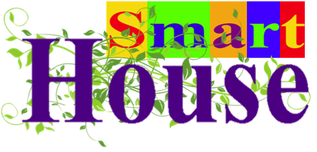
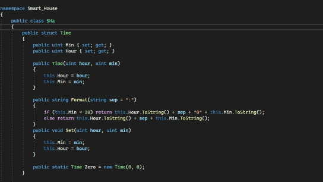
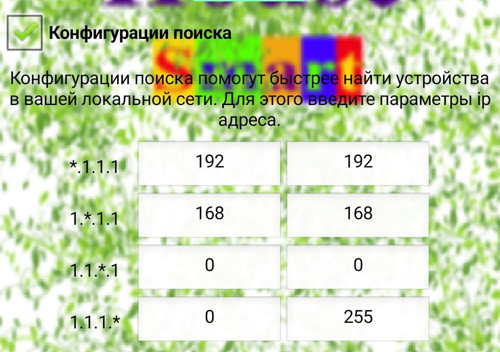
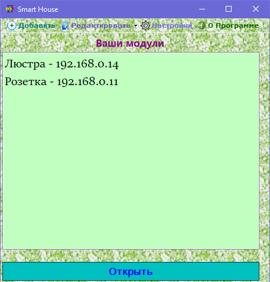
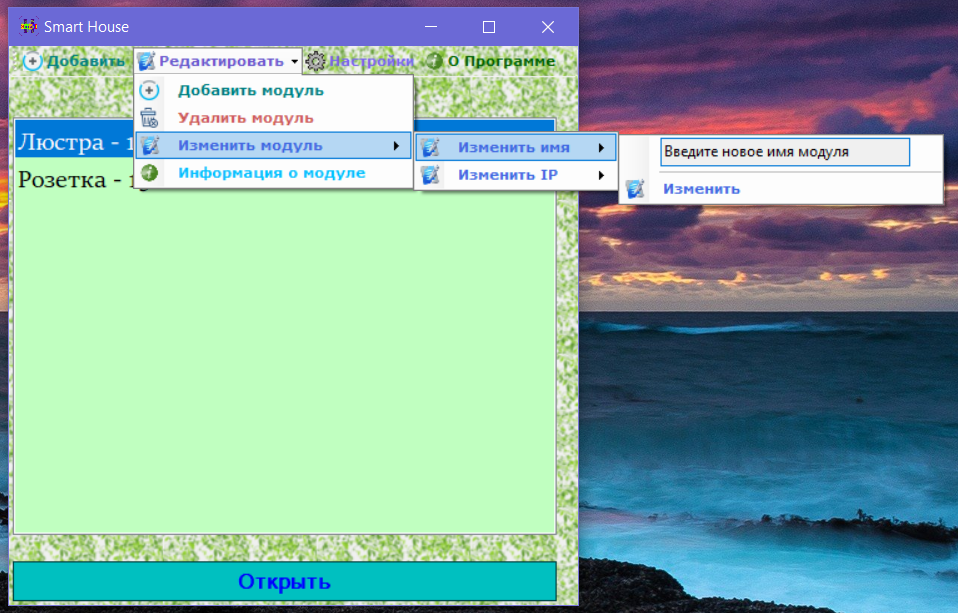
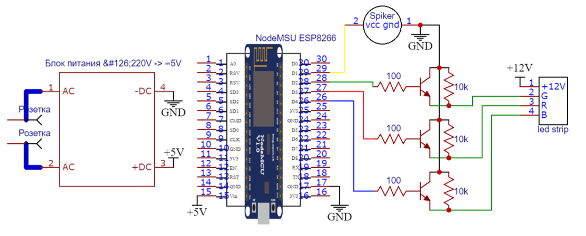
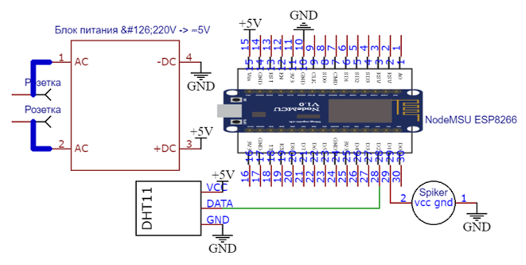
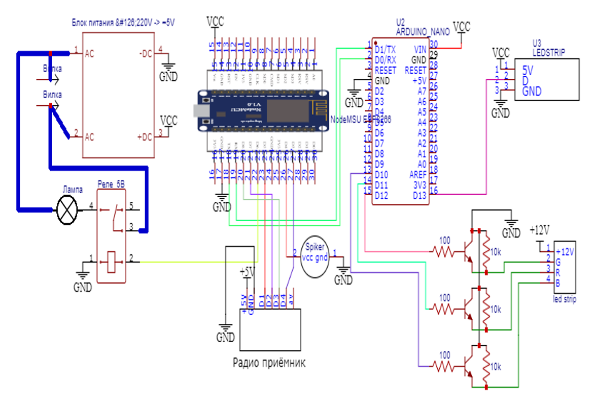

# 🏡 Smart House – Умная система для дома

> 💡 Проект по созданию умных модулей и программного обеспечения для управления домом.  
> 🔧 Открытый код, DIY-подход, Wi-Fi и проводные решения.

[🌐 Официальный сайт](https://akylinandrej.wixsite.com/smart-house)  
[📦 Код модулей и схемы](https://github.com/ColdenI/SmartHouse-project)  
[💻 Приложение для Windows](https://github.com/ColdenI/SmartHouse)  
[📄 Презентация и аннотация](https://github.com/ColdenI/SmartHouse/blob/main/презентация/Создание модулей умного дома.pdf)

---

## 🌐 Что такое Smart House?

**Smart House** — это целая система связанных между собой датчиков и модулей, предназначенная для создания безопасной и комфортной среды в доме.

Проект объединяет:
- **Физические модули** (умные розетки, люстры, термометры, RGB-контроллеры)
- **Программное обеспечение** для управления ими через локальную сеть Wi-Fi
- **Открытый код** как для аппаратной части, так и для ПО

---

## 🧩 Архитектура системы
┌─────────────┐ Wi-Fi / TCP/IP      ┌───────────────────┐
│ Умные модули│────────────────────►│ Приложение        │
│(Arduino,ESP)│                     │(Android / Windows)│
└─────────────┘                     └────┬──────────────┘
                                         ▼
                                ┌──────────────────────┐
                                │ Главный модуль       │
                                │ (объединение данных) │
                                └──────────────────────┘

---

## 🧰 Типы модулей

В рамках проекта были разработаны следующие модули:

| Модуль | Функции |
|-------|--------|
| **Умная розетка** | Включение/выключение электроприборов, таймер, расписание |
| **Умная люстра** | 7 цветов, 30 анимаций, будильник, яркость |
| **Умный термометр** | Измерение температуры и влажности, передача данных в приложение |
| **RGB контроллер** | Режимы: цвет, градиент, смена цвета, настройка скорости и яркости |

> Все модули строятся на основе общего шаблона и могут быть легко модифицированы.

---

## 🖥️ Приложение для управления

### 📱 Android-приложение
- Создано с помощью **MIT App Inventor**
- Поддерживает поиск модулей в сети
- Сохраняет параметры устройств
- Различает типы модулей и отправляет соответствующие команды

### 💻 Windows-приложение
- Написано на **C# (.NET Framework)**
- GUI-интерфейс с возможностью добавления, удаления и управления модулями
- Поддержка режимов: стандартный, по таймеру, по расписанию

> 🔗 [Скачать или просмотреть исходный код](https://github.com/ColdenI/SmartHouse)

---

## 🎥 Демонстрация работы

### Анимации модулей
  
*Анимация работы умной люстры*

  
*Интерфейс RGB-контроллера*

  
*Управление умной розеткой*

---

## 📸 Скриншоты интерфейса

  
*Главное окно программы*

  
*Настройка умного термометра*

  
*Добавление нового устройства*

---

## 🔧 Схемы сборки

  
*Схема подключения умной розетки*

  
*Схема RGB-контроллера*

  
*Схема умного термометра*

> Все схемы находятся в папке `MEDIA/схемы/`. Используйте их для сборки своих модулей.

---

## 📚 Документация и презентация

Подробное описание проекта, шаги разработки и технические детали доступны в презентации:

📎 [Скачать PDF-презентацию](https://github.com/ColdenI/SmartHouse/blob/main/презентация/Создание модулей умного дома.pdf)

> 📌 В файле содержится:
> - Аннотация проекта
> - Шаги разработки модулей
> - Структура приложения
> - Описание режимов работы

---

## 🛠️ Как использовать?

1. Загрузите код модулей: [https://github.com/ColdenI/SmartHouse-project](https://github.com/ColdenI/SmartHouse-project)
2. Соберите модули по схемам из папки `MEDIA/схемы/`
3. Загрузите прошивку на микроконтроллер (Arduino/ESP)
4. Запустите приложение на Windows или Android
5. Найдите модули в сети и начните управлять!

---

## 🤝 Как помочь?

Проект открыт для всех!
- 🐞 Сообщайте о багах
- 💡 Предлагайте новые функции
- 🧑‍💻 Вносите изменения в код
- 📚 Делитесь своими модификациями

---

## 📜 Лицензия

Проект распространяется под лицензией **MIT**.  
Вы можете свободно использовать, изменять и распространять код.

---

## 📬 Контакты

Разработчик: [Andrei Akylin](https://akylinandrej.wixsite.com/smart-house)  
Email: andreiakulin2005044@gmail.com  
GitHub: [@ColdenI](https://github.com/ColdenI)

---

> 🌟 Умный дом начинается с одной идеи. Делайте его безопаснее, удобнее и красивее вместе!
